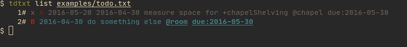

# tdtxt-cli

This project for now only serves as an example what can be done with the
[`todo.txt`](https://github.com/todotxt/todo.txt) parsing library
[`tdtxt`](https://github.com/Shemnei/tdtxt).

## Screenshots

